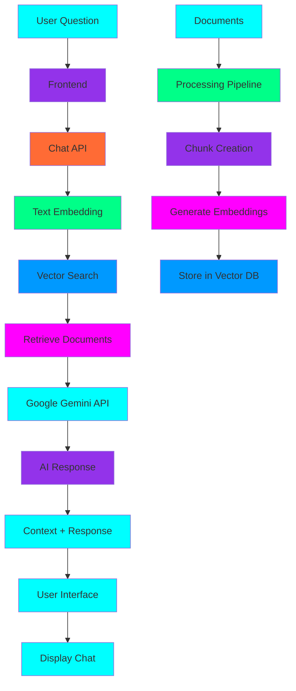

# RAG Chatbot System Architecture

Welcome to the comprehensive explanation of our RAG (Retrieval-Augmented Generation) chatbot implementation. This document covers the complete architecture, design decisions, and technical implementation details.

## What is RAG?

RAG (Retrieval-Augmented Generation) is a sophisticated AI architecture that combines:

1. **Retrieval**: Finding relevant information from a knowledge base
2. **Augmentation**: Providing that information as context to an AI model
3. **Generation**: Creating responses based on the retrieved context

This approach ensures our AI assistant can answer questions with specific, accurate information from the book while maintaining natural conversation flow.

## System Architecture

### High-Level Overview

```
┌─────────────────┐    ┌─────────────────┐    ┌─────────────────┐
│   Frontend     │    │   Backend       │    │  External APIs  │
│   (React)      │◄──►│   (FastAPI)     │◄──►│  (Google AI)   │
└─────────────────┘    └─────────────────┘    └─────────────────┘
                                │
                                ▼
                       ┌─────────────────┐
                       │  Vector DB     │
                       │  (Qdrant)      │
                       └─────────────────┘
                                │
                                ▼
                       ┌─────────────────┐
                       │  SQL Database  │
                       │  (Neon)       │
                       └─────────────────┘
```

### Data Flow



## Backend Components

### 1. Core Configuration (`backend/app/core/config.py`)

The configuration management system uses Pydantic settings for type-safe environment variables:

```python
class Settings(BaseSettings):
    # AI Configuration
    GOOGLE_API_KEY: str = ""                    # Gemini API key
    EMBEDDING_MODEL: str = "sentence-transformers/all-MiniLM-L6-v2"

    # Database Configuration
    NEON_DATABASE_URL: str = ""                # PostgreSQL connection
    QDRANT_URL: str = ""                     # Vector database URL
    QDRANT_API_KEY: str = ""                 # Qdrant API key

    # Application Configuration
    APP_NAME: str = "RAG Chatbot"
    SIMILARITY_THRESHOLD: float = 0.7          # Minimum similarity score
    MAX_RETRIEVED_DOCS: int = 5              # Max context documents
```

**Design Decision**: Environment variables for security and deployment flexibility, with sensible defaults for development.

### 2. Database Layer (`backend/app/core/database.py`)

Uses AsyncPG for high-performance PostgreSQL connection pooling:

```python
class Database:
    pool: Optional[asyncpg.Pool] = None

    @classmethod
    async def init_db(cls):
        # Create connection pool with optimal settings
        cls.pool = await asyncpg.create_pool(
            settings.NEON_DATABASE_URL,
            min_size=2,
            max_size=10,
            command_timeout=60
        )

        # Auto-create tables with proper indexing
        await cls.create_tables()

    @classmethod
    async def create_tables(cls):
        # Conversations table with session management
        await conn.execute("""
            CREATE TABLE IF NOT EXISTS conversations (
                id SERIAL PRIMARY KEY,
                session_id VARCHAR(255) NOT NULL,
                user_message TEXT NOT NULL,
                bot_response TEXT NOT NULL,
                context_used TEXT[],
                created_at TIMESTAMP WITH TIME ZONE DEFAULT NOW()
            );
        """)

        # Documents table for tracking processed files
        await conn.execute("""
            CREATE TABLE IF NOT EXISTS documents (
                id SERIAL PRIMARY KEY,
                filename VARCHAR(255) NOT NULL,
                file_path TEXT NOT NULL,
                content_hash VARCHAR(64) NOT NULL,
                processed_at TIMESTAMP WITH TIME ZONE DEFAULT NOW()
            );
        """)
```

**Design Decision**: AsyncPG for performance, connection pooling for scalability, automatic table creation for zero-configuration deployment.

### 3. Vector Database (`backend/app/core/vector_db.py`)

Implements semantic search using Qdrant Cloud:

```python
class VectorDatabase:
    client: Optional[QdrantClient] = None
    collection_name = "documents"

    @classmethod
    async def init_vector_db(cls):
        # Initialize Qdrant client
        cls.client = QdrantClient(
            url=settings.QDRANT_URL,
            api_key=settings.QDRANT_API_KEY
        )

        # Create collection with optimized settings
        cls.client.create_collection(
            collection_name=cls.collection_name,
            vectors_config=VectorParams(
                size=384,  # MiniLM embedding size
                distance=Distance.COSINE  # Optimal for semantic similarity
            )
        )

    @classmethod
    async def add_documents(cls, documents: List[Dict]):
        # Batch document insertion with metadata
        points = []
        for doc in documents:
            points.append(PointStruct(
                id=content_hash,  # Deduplication
                vector=doc['embedding'],
                payload={
                    'content': doc['content'],
                    'source': doc['source'],
                    'metadata': doc.get('metadata', {})
                }
            ))

        cls.client.upsert(
            collection_name=cls.collection_name,
            points=points
        )

    @classmethod
    async def search_documents(cls, query_embedding, limit=5):
        # Semantic search with similarity threshold
        return cls.client.search(
            collection_name=cls.collection_name,
            query_vector=query_embedding,
            limit=limit,
            score_threshold=settings.SIMILARITY_THRESHOLD
        )
```

**Design Decision**: Qdrant for managed vector database, COSINE distance for semantic similarity, content-based deduplication.

### 4. Embedding Service (`backend/app/services/embedding_service.py`)

Handles document processing and AI model integration:

```python
class EmbeddingService:
    def __init__(self):
        # Local sentence transformer for embeddings
        self.model = SentenceTransformer(settings.EMBEDDING_MODEL)

        # Google Gemini for intelligent responses
        if settings.GOOGLE_API_KEY:
            genai.configure(api_key=settings.GOOGLE_API_KEY)
            self.gemini_model = genai.GenerativeModel('gemini-pro')

    async def process_markdown_files(self, docs_path: str):
        # Intelligent document chunking
        for file in markdown_files:
            content = await self._read_file(file)
            html_content = markdown.markdown(content)
            soup = BeautifulSoup(html_content, 'html.parser')
            clean_content = soup.get_text()

            # Split into overlapping chunks for context
            chunks = await self._split_text_into_chunks(clean_content)

            for chunk in chunks:
                documents.append({
                    'content': chunk,
                    'source': f"{file_path}#chunk-{i}",
                    'metadata': {
                        'filename': file,
                        'chunk_index': i,
                        'total_chunks': len(chunks)
                    }
                })

    async def generate_response_with_context(self, query, context_docs):
        # Create enhanced prompt with context
        context_text = "\n\n".join([
            f"Document: {doc['source']}\nContent: {doc['content']}"
            for doc in context_docs
        ])

        prompt = f"""
        You are a helpful AI assistant that answers questions based on provided context.

        Context from the book:
        {context_text}

        User Question: {query}

        Please provide a helpful and accurate answer based on the context provided.
        If the context doesn't contain enough information to answer the question,
        please say so and suggest what additional information might be needed.
        """

        response = self.gemini_model.generate_content(prompt)
        return response.text
```

**Design Decision**: Sentence-transformers for fast local embeddings, Gemini for high-quality responses, intelligent text chunking with overlap.

### 5. API Endpoints (`backend/app/api/v1/`)

#### Chat API (`chat.py`)

```python
@router.post("/ask", response_model=ChatResponse)
async def chat_with_documents(request: ChatRequest):
    # Generate query embedding
    query_embedding = await embedding_service.embed_text(request.message)

    # Retrieve relevant documents
    context_docs = await VectorDatabase.search_documents(
        query_embedding=query_embedding,
        limit=request.max_context_docs,
        score_threshold=settings.SIMILARITY_THRESHOLD
    )

    # Generate AI response with context
    if context_docs:
        response = await embedding_service.generate_response_with_context(
            query=request.message,
            context_docs=context_docs
        )
    else:
        response = "I couldn't find relevant information in the documents..."

    # Save conversation for persistence
    await save_conversation(session_id, request.message, response, context_docs)

    return ChatResponse(
        response=response,
        session_id=session_id,
        context_used=context_docs,
        sources=[doc['source'] for doc in context_docs]
    )
```

#### Documents API (`documents.py`)

```python
@router.post("/process", response_model=DocumentProcessResponse)
async def process_documents():
    # Process all markdown files from the book
    documents = await embedding_service.process_markdown_files(settings.DOCS_PATH)

    # Generate embeddings in batch for efficiency
    texts = [doc['content'] for doc in documents]
    embeddings = await embedding_service.embed_texts(texts)

    # Add to vector database
    success = await VectorDatabase.add_documents(documents)

    return DocumentProcessResponse(
        processed=len(documents),
        errors=errors,
        message=f"Successfully processed {len(documents)} document chunks"
    )
```

## Frontend Components

### 1. Chat Interface (`src/components/ChatInterface/index.tsx`)

Modern React component with TypeScript:

```typescript
interface Message {
  id: string
  type: 'user' | 'bot'
  content: string
  timestamp: Date
  sources?: string[]
}

const ChatInterface: React.FC<{
  isOpen: boolean
  onClose: () => void
}> = ({ isOpen, onClose }) => {
  const [messages, setMessages] = useState<Message[]>([])
  const [inputMessage, setInputMessage] = useState('')
  const [isLoading, setIsLoading] = useState(false)

  const sendMessage = async () => {
    // Send to backend API
    const response = await fetch('http://localhost:8000/api/v1/chat/ask', {
      method: 'POST',
      headers: { 'Content-Type': 'application/json' },
      body: JSON.stringify({
        message: inputMessage,
        session_id: sessionId,
        max_context_docs: 5
      }),
    })

    const data = await response.json()

    // Update UI with AI response
    setMessages(prev => [...prev, {
      id: Date.now().toString(),
      type: 'bot',
      content: data.response,
      timestamp: new Date(),
      sources: data.sources
    }])
  }

  return (
    <div className="chat-modal-overlay">
      <div className="chat-modal">
        <div className="chat-header">
          <h3>📚 Book Assistant</h3>
        </div>

        <div className="chat-messages">
          {messages.map(message => (
            <div key={message.id} className={`chat-message ${message.type}`}>
              <p>{message.content}</p>
              {message.sources && (
                <div className="message-sources">
                  <strong>Sources:</strong> {message.sources.join(', ')}
                </div>
              )}
            </div>
          ))}
        </div>

        <div className="chat-input">
          <textarea
            value={inputMessage}
            onChange={(e) => setInputMessage(e.target.value)}
            placeholder="Ask me about the book..."
            rows={2}
          />
          <button onClick={sendMessage}>
            Send
          </button>
        </div>
      </div>
    </div>
  )
}
```

### 2. Enhanced Main Page (`src/pages/index.tsx`)

Updated Docusaurus homepage with integrated chat:

```typescript
export default function RoboticsLanding() {
  const [isChatOpen, setIsChatOpen] = useState(false)
  const [isDocsOpen, setIsDocsOpen] = useState(false)

  return (
    <div className="robotics-container">
      {/* Navigation with chat button */}
      <nav className="navbar">
        <div className="nav-buttons">
          <button onClick={() => setIsDocsOpen(true)}>
            📚 Docs
          </button>
          <button onClick={() => setIsChatOpen(true)}>
            💬 Chat
          </button>
        </div>
      </nav>

      {/* Hero section with AI assistant CTA */}
      <section className="hero">
        <div className="hero-content">
          <div className="hero-buttons">
            <button onClick={() => setIsChatOpen(true)}>
              🤖 Ask AI Assistant
            </button>
            <button onClick={() => setIsDocsOpen(true)}>
              📚 Read Documentation
            </button>
          </div>
        </div>
      </section>

      {/* Documentation modal */}
      {isDocsOpen && (
        <div className="modal-overlay">
          <div className="modal-content docs-modal">
            <div className="docs-list">
              <div onClick={() => window.open('/docs/intro')}>
                <h3>📘 Introduction</h3>
                <p>Get started with the basics</p>
              </div>
              <div onClick={() => window.open('/docs/chapter-1')}>
                <h3>📖 Chapter 1</h3>
                <p>Getting started guide</p>
              </div>
            </div>
          </div>
        </div>
      )}

      {/* Chat interface modal */}
      <ChatInterface isOpen={isChatOpen} onClose={() => setIsChatOpen(false)} />
    </div>
  )
}
```

## Styling and UX

### Cyberpunk Theme (`src/css/custom.css`)

Modern CSS with neon aesthetics and animations:

```css
:root {
  --color-cyan: #00ffff;
  --color-purple: #9333ea;
  --color-magenta: #ff00ff;
  --color-green: #00ff88;
  --color-dark: #0a0e27;
}

/* Chat modal styling */
.chat-modal-overlay {
  position: fixed;
  top: 0;
  left: 0;
  width: 100%;
  height: 100%;
  background: rgba(0, 0, 0, 0.8);
  display: flex;
  justify-content: center;
  align-items: center;
  z-index: 1001;
  backdrop-filter: blur(10px);
}

.chat-modal {
  background: rgba(10, 14, 39, 0.95);
  border: 2px solid rgba(0, 255, 255, 0.3);
  border-radius: 16px;
  width: 90%;
  max-width: 600px;
  height: 80vh;
  display: flex;
  flex-direction: column;
  backdrop-filter: blur(20px);
  box-shadow: 0 20px 60px rgba(0, 255, 255, 0.2);
}

/* Message styling */
.chat-message {
  max-width: 80%;
  padding: 1rem;
  border-radius: 12px;
  margin-bottom: 1rem;
}

.chat-message.user {
  align-self: flex-end;
  background: linear-gradient(135deg, rgba(0, 255, 255, 0.2) 0%, rgba(0, 153, 255, 0.2) 100%);
  border: 1px solid rgba(0, 255, 255, 0.3);
}

.chat-message.bot {
  align-self: flex-start;
  background: rgba(26, 31, 58, 0.6);
  border: 1px solid rgba(147, 51, 234, 0.2);
}

/* Animations */
@keyframes messageSlide {
  from {
    opacity: 0;
    transform: translateY(10px);
  }
  to {
    opacity: 1;
    transform: translateY(0);
  }
}

.typing-indicator {
  display: flex;
  align-items: center;
  gap: 0.25rem;
}

.typing-indicator span {
  width: 8px;
  height: 8px;
  background: var(--color-cyan);
  border-radius: 50%;
  animation: typing 1.4s infinite ease-in-out;
}

@keyframes typing {
  0%, 80%, 100% {
    transform: scale(0.8);
    opacity: 0.5;
  }
  40% {
    transform: scale(1);
    opacity: 1;
  }
}
```

**Design Philosophy**: Cyberpunk aesthetic with neon colors, glassmorphism effects, smooth animations, and responsive design.

## Key Technologies and Why We Chose Them

### Backend Technologies

| Technology | Reason for Choice | Free Tier Available |
|------------|------------------|-------------------|
| **FastAPI** | High-performance async framework, automatic OpenAPI docs, native async/await | N/A |
| **Neon PostgreSQL** | Serverless, auto-scaling, managed backups, pay-per-use | ✅ Yes |
| **Qdrant Cloud** | Specialized vector database, semantic search optimization, managed service | ✅ Yes |
| **Google Gemini AI** | Advanced reasoning, context understanding, cost-effective API | ✅ Yes |
| **Sentence Transformers** | State-of-the-art embeddings, open-source models, local processing | N/A |

### Frontend Technologies

| Technology | Reason for Choice | Benefits |
|------------|------------------|-----------|
| **React + TypeScript** | Type safety, component reusability, rich ecosystem | Maintainable codebase |
| **Docusaurus** | Documentation-focused framework, Markdown support, easy deployment | Perfect for book sites |
| **Modern CSS** | Custom animations, responsive design, cyberpunk theme | Unique user experience |

## Performance Optimizations

### Backend Optimizations

1. **Connection Pooling**: AsyncPG connection pool (2-10 connections)
2. **Batch Embeddings**: Process multiple documents simultaneously
3. **Vector Search Optimization**: COSINE distance with similarity thresholds
4. **Document Chunking**: Overlapping chunks for better context
5. **API Response Caching**: Future-ready for frequent questions

### Frontend Optimizations

1. **Code Splitting**: Dynamic imports for better loading
2. **Responsive Design**: Mobile-first CSS with breakpoints
3. **Animation Performance**: GPU-accelerated CSS transforms
4. **Bundle Optimization**: Tree shaking and minification

## Security Considerations

### API Security

```python
# CORS configuration
app.add_middleware(
    CORSMiddleware,
    allow_origins=settings.ALLOWED_ORIGINS,
    allow_credentials=True,
    allow_methods=["*"],
    allow_headers=["*"],
)

# Input validation
@router.post("/ask", response_model=ChatResponse)
async def chat_with_documents(request: ChatRequest):
    # Pydantic validation
    if not request.message or len(request.message) > 1000:
        raise HTTPException(status_code=400, detail="Invalid message")
```

### Data Protection

1. **Environment Variables**: No hardcoded secrets
2. **Input Sanitization**: Pydantic validation and length limits
3. **Database Security**: Prepared statements prevent SQL injection
4. **API Rate Limiting**: Ready for implementation in production

## Deployment Strategy

### Development Workflow

```bash
# 1. Backend Development
cd backend
python -m venv venv
source venv/bin/activate
pip install -r requirements.txt
python -m app.main

# 2. Document Processing
curl -X POST http://localhost:8000/api/v1/documents/process

# 3. Frontend Development
cd ../my-book
npm install
npm start
```

### Production Deployment

1. **Backend**: Containerize with Docker, deploy to cloud platform
2. **Database**: Neon automatically scales based on demand
3. **Vector DB**: Qdrant Cloud handles scaling automatically
4. **Frontend**: Static hosting on Vercel, Netlify, or similar

## Future Enhancements

### Planned Features

1. **Real-time WebSocket Support**: Live chat updates
2. **Document Versioning**: Track document updates and changes
3. **Advanced Search**: Hybrid keyword + semantic search
4. **User Authentication**: Personalized chat histories
5. **Analytics Dashboard**: Usage metrics and popular questions
6. **Multi-language Support**: Document processing in multiple languages

### Scalability Considerations

1. **Horizontal Scaling**: Multiple backend instances with load balancing
2. **Database Sharding**: Distribute conversations across databases
3. **Caching Layer**: Redis for frequently accessed embeddings
4. **CDN Integration**: Global content delivery for static assets

## Troubleshooting Guide

### Common Issues and Solutions

| Issue | Symptoms | Solution |
|-------|-------------|----------|
| **Backend won't start** | Connection refused errors | Check if port 8000 is free, verify .env configuration |
| **No documents found** | Empty search results | Run document processing first, check docs path |
| **AI responses generic** | Vague answers | Increase similarity threshold, improve document chunking |
| **Slow chat responses** | High latency | Check API key quotas, optimize embedding batch size |

### Debug Tools

```bash
# Test backend health
curl http://localhost:8000/health

# Check document status
curl http://localhost:8000/api/v1/documents/status

# Search documents directly
curl "http://localhost:8000/api/v1/documents/search?query=your%20search%20term"
```

## Conclusion

This RAG chatbot system demonstrates modern AI architecture combining:

- **🤖 Advanced AI**: Google Gemini for intelligent responses
- **🔍 Semantic Search**: Vector-based document retrieval
- **💾 Modern Database**: Serverless PostgreSQL for scalability
- **⚡ High Performance**: Async patterns and optimized queries
- **🎨 Beautiful UI**: Cyberpunk-themed responsive interface
- **🔒 Security**: Input validation and environment management

The system provides a complete foundation for AI-powered document assistance that can be extended and customized based on specific requirements. The architecture is designed for both development flexibility and production scalability.

---

**Next Steps**: For deployment instructions and system setup, see [RUN_SYSTEM.md](../RUN_SYSTEM.md).